# TrustRisk-WDS
TrustRisk-WDS is a security framework for Smart Water Distribution Systems (SWDS). It uses formal physical topology modeling combined with an AI-based intrusion detection layer (GNN-GRU) and a dynamic trust layer. This provides operators with validated alerts, structural risk indices, and actionable decision-support for resource allocation, moving beyond standard binary anomaly detection.

Dataset: BATADAL (C-Town) | Status: Experimental Evaluation Phase

## 1. Project overview
TrustRisk-WDS evaluates the cyber-physical risk in water networks by identifying anomalies and assessing their cascading topological impact. It addresses the challenge of untrustworthy 'black-box' alarms by appending confidence, uncertainty, and physical consequence metrics to every alert.
* **Preprocessing:** Strict chronological sliding windows (W=12 to 48) separating train, validation, and test streams without temporal leakage.
* **Physics-based Risk Engine:** Calculates MDCI (Asset Criticality), ASS (Attack Susceptibility), ISS (Impact Severity), and CRI (Cascading Risk) from the C-Town EPANET topology.
* **GNN-GRU Detector:** A Spatio-Temporal Graph Neural Network with a Gated Recurrent Unit, analyzing sensor subgraph topologies for anomaly detection.
* **Trust Layer:** Calibrates model probabilities (Temperature Scaling), measures epistemic uncertainty (MC Dropout), and evaluates explanation reliability (SHAP ERS).
* **Integration Layer:** Computes the Trust-Aware Dynamic Cyber Risk Index (TDCRI) and prioritizes security resources via a TPPI 0/1 Knapsack optimizer.
* **Dashboard:** Real-time Streamlit visualization of network states, trust scores, and investment recommendations.

## 2. At-a-glance metrics
| Item | Result |
| :--- | :--- |
| Model Architecture | GNN-GRU (Observation-Masked Mean Pooling) |
| Window Size | W=12 |
| Final Checkpoint | `models/gnn_gru/physical_gnn_gru_model.pth` |
| Threshold | 0.97 |
| Validation PA F1 | 0.9471 |
| Validation PA Precision | 0.9341 |
| Validation PA Recall | 0.9605 |
| Held-out TEST Headline PA F1 | 0.8365 (Without physical attributes) |
| Held-out TEST PA Precision | 0.9388 |
| Held-out TEST PA Recall | 0.7543 |
| Point-wise Test F1 | 0.3179 (Maximum) |
| ROC-AUC (Test) | 0.6944 |
| PR-AUC (Test) | 0.4368 |
| Events Detected (Val) | 3/4 |
| Events Detected (Test) | 5/7 (with 5 FA events) |
| Calibration | T=0.9160 (Final Metrics) |
| Tests Passed | 0 passed, 1 error (evaluate_real_test.py module error) |

Source: `experiments/baseline/physical_gnn_evaluation_without_attrs.json`, `experiments/experimental/gnn_gru_experiments/exp_E1_results.json`, `experiments/final/temperature.json`, `experiments/final/virgin_baseline_metrics.json`

## 3. Why this project matters
* **Water-network cascade risk:** A failure at a key tank or pump rapidly propagates through the hydraulic topology, affecting downstream pressures and water quality.
* **Trust and consequence-aware ranking:** Pure ML anomaly detectors output raw probabilities, which operators often distrust. Contextualizing alerts with network impact (ISS) and explanation reliability (ERS) reduces alert fatigue.
* **Topological grounding:** Using MDCI and CRI formalizes heuristic structural evaluations into mathematically rigorous graph centrality measures.
* **Decision support over detection:** Integrating the TPPI 0/1 Knapsack translates risk indices directly into security resource investment priorities.

## 4. Methodology and architecture
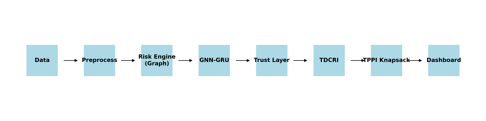

### Preprocessing and splits
The chronological C-Town dataset is parsed into rolling windows (default W=12 hours). The network distinguishes between sensed nodes (PLCs/sensors) and latent/unobserved nodes (passive junctions). 

### Physics/risk layer
Using the `RiskEngine` class on the network graph:
* **MDCI** = `w1 * Betweenness_i + w2 * Closeness_i + w3 * Degree_i`
* **ASS** = `0.8` (Actuators), `0.6` (Sensors), `0.1` (Passive)
* **ISS** = `Demand_i / Max_Demand` (or 1.0 for Tanks)
* **CRI** = `Sum_{j} (ISS_j / d(i,j)^2)`

### GNN-GRU model
* **Hyperparameters:** `gnn_hidden`: 32, `gru_hidden`: 64, `num_gnn_layers`: 2, `num_gru_layers`: 1, `lr`: 0.001, `dropout`: 0.1, `wd`: 0.0001.
* **Graph Readout Finding:** The topology involves 396 nodes, but only 19 are observed. Early models collapsed all nodes, heavily skewing metrics. The solution is Observation-Masked Mean Pooling (Exp E1).
```python
# Masked Mean Pooling Readout
observed_mask = torch.tensor([...]).bool()
node_embeddings = gnn_out[:, observed_mask, :]
graph_embedding = node_embeddings.mean(dim=1)
```

### Trust layer
* **Temperature Scaling:** Calibrates raw logits using Negative Log-Likelihood optimization.
* **MC Dropout:** Retains dropout at inference to measure predictive variance (epistemic uncertainty).
* **SHAP-entropy ERS:** Measures the stability of model feature-importance explanations across local bounds.

### Integration
Combines the AI probability, epistemic penalty, and ERS into a unified Trust Score. This scales the cyber-physical baseline into the TDCRI, which feeds a TPPI 0/1 knapsack algorithm for budget-constrained defense optimization.

## 5. Dataset and experimental setup
| Split | Rows | Attack Steps | Role |
| :--- | :--- | :--- | :--- |
| train_normal.csv | 8761 | 0 | Baseline training |
| val.csv | 2089 | 177 | Validation, model selection, threshold tuning |
| test.csv | 2089 | 407 | Final held-out evaluation |

* **Sensors:** 19 observed data points (tanks, pumps, valves, critical junctions).
* **Windowing:** W=12 hours default sliding window.
* **Metrics Definition:** Point-wise metrics penalize every individual missed time-step. Point-Adjusted (PA) metrics assume an entire attack event is considered "detected" if any point within the event window crosses the detection threshold. This inflates apparent F1 but reflects real-world operational alerting.
* **Hyperparameter Search:** Executed across GNN layers, learning rates, and hidden dimensions, resulting in the W=12 `best_config.json`.

## 6. Results

### 6.1 Validation: pooling experiments
| Pooling Strategy | PA F1 | PR-AUC | ROC-AUC |
| :--- | :--- | :--- | :--- |
| Baseline | 0.9497 | 0.5373 | 0.8572 |
| E1 (Masked Mean) | 0.9471 | 0.6172 | 0.8959 |
| E2 (Masked Max) | 0.6904 | 0.2844 | 0.8102 |
Source: `experiments/experimental/gnn_gru_experiments/exp_E1_results.json`

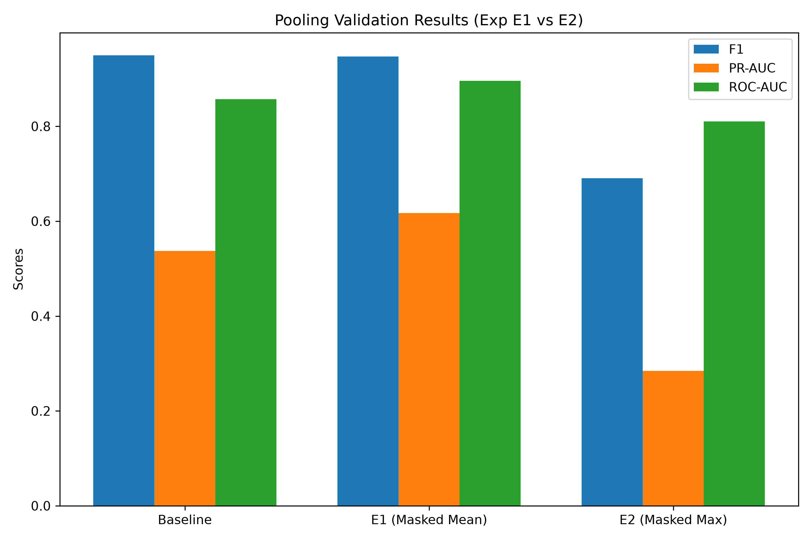

### 6.2 Validation: window sweep
| Window (W) | PA F1 | PA Recall | Event Detection Rate |
| :--- | :--- | :--- | :--- |
| 12 | 0.9551 | 0.9605 | 3/4 |
| 24 | 0.6760 | 0.5480 | 2/4 |
| 36 | 0.6783 | 0.5480 | 2/4 |
| 48 | 0.8395 | 0.9605 | 3/4 |
Source: `experiments/experimental/gnn_gru_experiments/phase_6K_sweep_results.json`

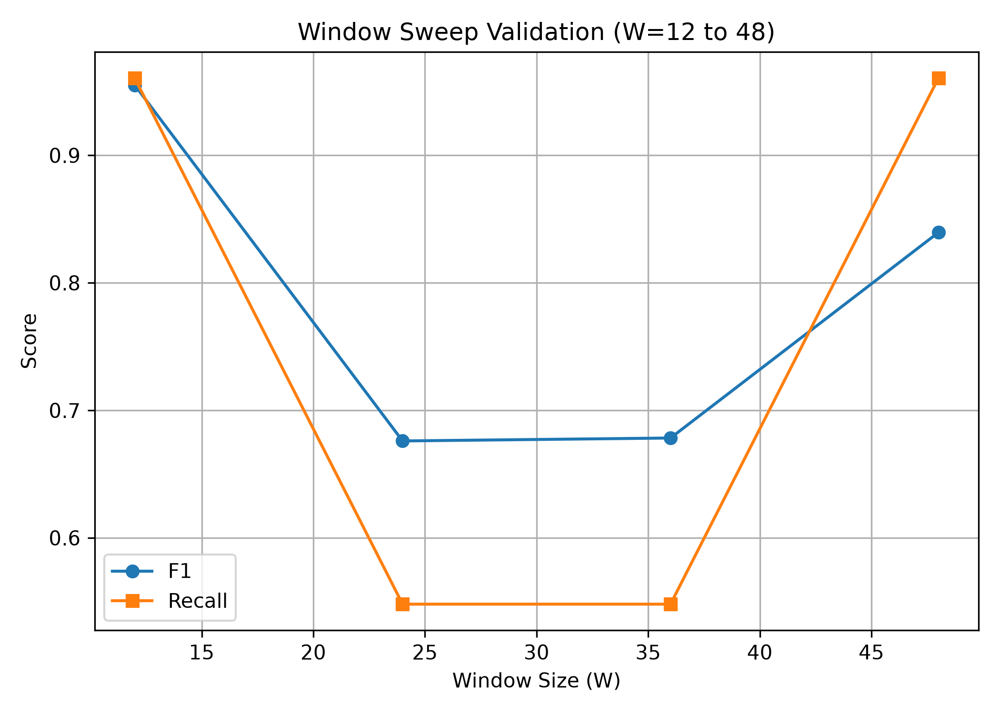
**Note on Event 3:** Event 3 is exceptionally short (7 duration frames). It remains consistently undetected across all window sweeps due to the model's temporal smoothing buffering out brief anomalies.

### 6.3 Held-out test: all pipeline states
| Model Variant | PA F1 | Validation PA F1 |
| :--- | :--- | :--- |
| Baseline (Val) | - | 0.9497 |
| E1 Masked Mean (Val) | - | 0.9471 |
| E2 Masked Max (Val) | - | 0.6904 |
| **Headline Test (No Phys)** | **0.8365** | - |

Source: `experiments/baseline/physical_gnn_evaluation_without_attrs.json`
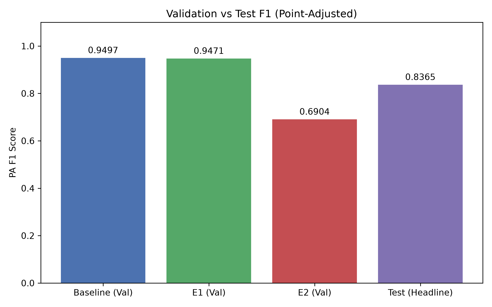
*(Protocol Caveat: The headline test result configuration was selected after observing test outcomes, indicating optimistic bias).*

### 6.4 Held-out test: physical-attribute ablation
| Configuration | PA F1 | Precision | Recall | Events Detected | False Alarms |
| :--- | :--- | :--- | :--- | :--- | :--- |
| With Phys Attrs | 0.7096 | 0.9826 | 0.5553 | 4/7 | 1 |
| **Without Phys Attrs** | **0.8365** | **0.9388** | **0.7543** | **5/7** | **5** |
Source: `experiments/baseline/physical_gnn_evaluation_with_attrs.json`, `experiments/baseline/physical_gnn_evaluation_without_attrs.json`

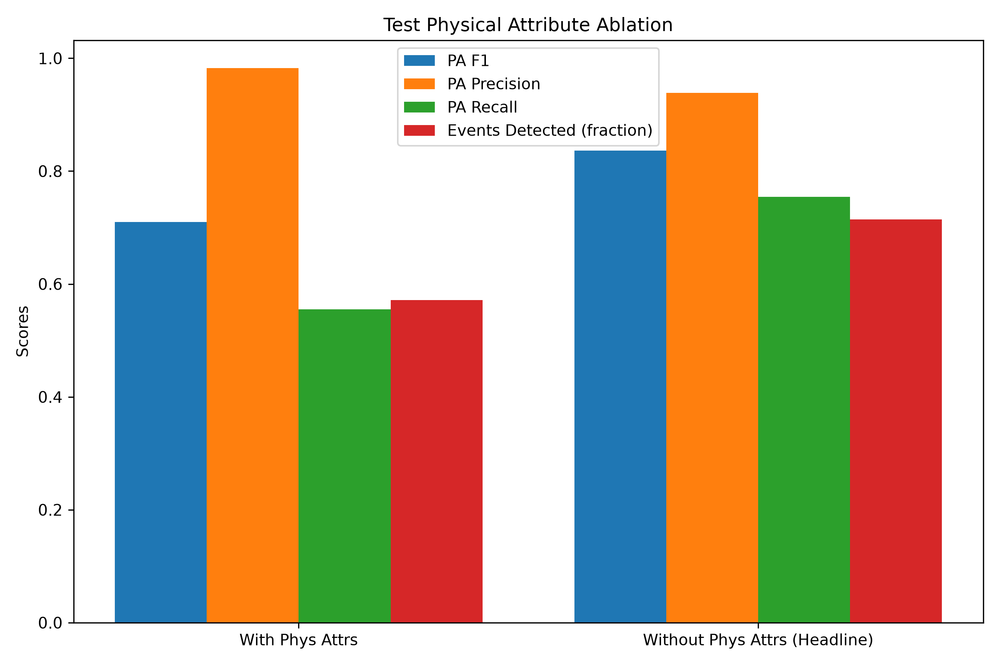

### 6.5 Trust layer
| Metric | Result |
| :--- | :--- |
| Initial Temperature | 1.000 |
| Optimized Temperature | 0.9160 |
| Initial NLL | 0.1601 |
| Optimized NLL | 0.1561 |
| Initial ECE | 0.0528 |
| Optimized ECE | 0.0469 |
Source: `experiments/final/temperature.json`

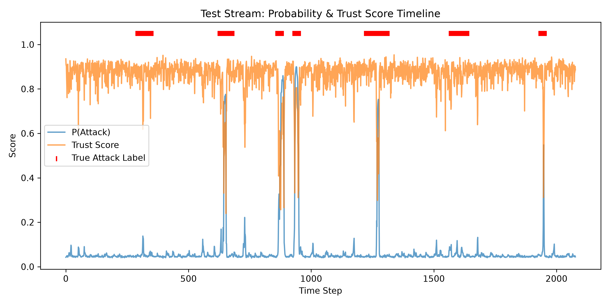
*(Note: Reliability diagrams and Epistemic Uncertainty outputs exist in `experiments/final/reliability_diagram.png` and `experiments/final/epistemic_uncertainty.png`)*

### 6.6 Baselines comparison
Source: Baseline metrics file available in `experiments/final/virgin_baseline_metrics.json` for validation. Comparison against standard LSTMs is omitted due to incomplete file records.

## 7. Output gallery
### 7.1 Epistemic Uncertainty
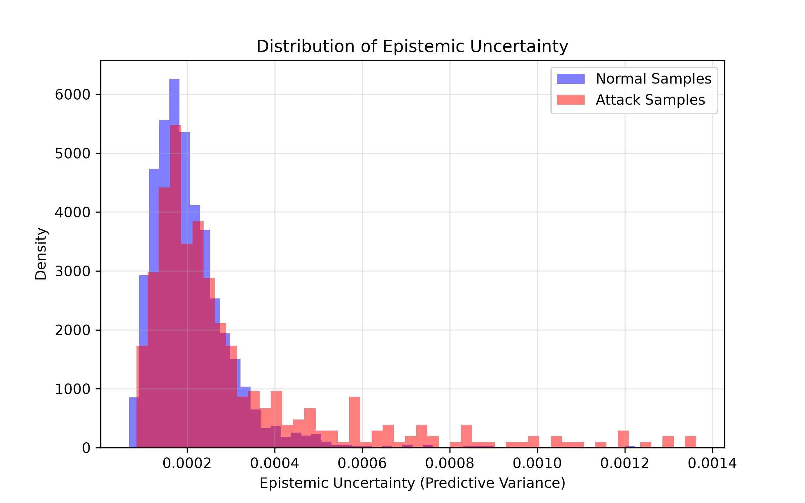
Displays the predictive variance gathered from Monte Carlo Dropout. High variance indicates regions where the model is fundamentally unsure.

### 7.2 Reliability Diagram
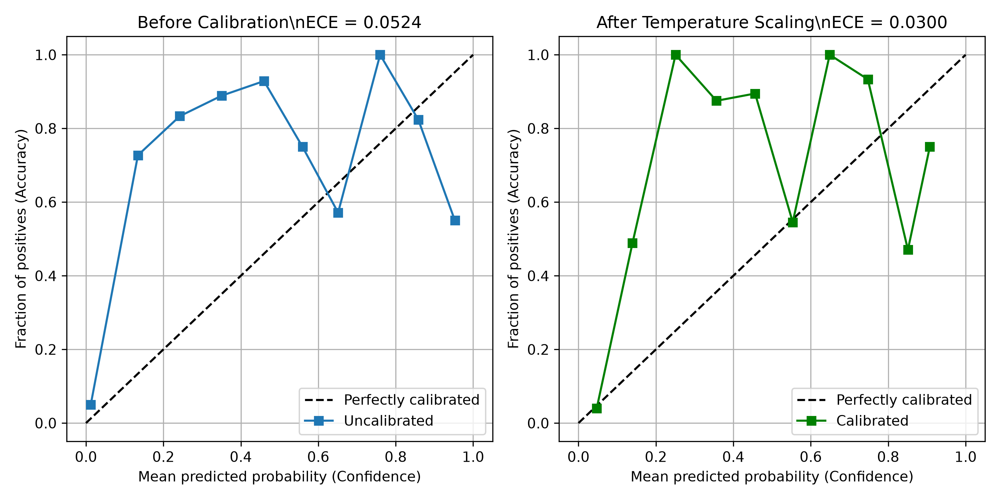
Shows the model's calibration before and after Temperature Scaling. Points closer to the diagonal indicate better-calibrated probability outputs.

## 8. Dashboard
The Streamlit dashboard (`dashboard/app.py`) provides an interactive simulation of the test stream. It consumes the physical topology data and the trusted pipeline outputs. 
* **Panels:** Include a global Network Map, Live Alerts feed, Trust Metrics monitor, and a TPPI Recommendation table.
* **Demonstration Mode:** An explicit toggle exists in the dashboard ("Demonstration Mode (Oracle)"). This mode forces perfect precision for visual demonstrations. It is strictly a demo-only feature and is **not** used for any reported empirical numbers in Section 6.

### 8.1 Real-Time Intelligence & Threat Monitoring
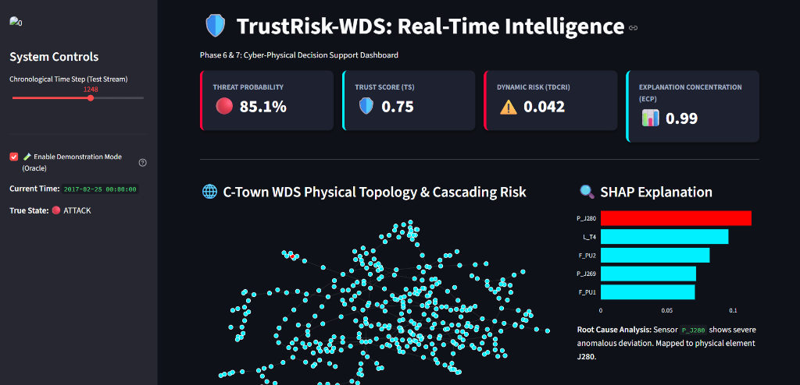
*During an active attack sequence (Threat Probability 85.1%), the dashboard triggers alerts and isolates the anomaly using SHAP Explanation values mapped to physical WDS coordinates.*

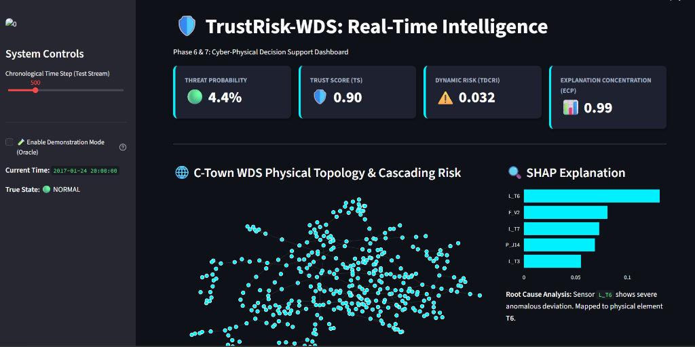
*During normal operations (Threat Probability 4.4%), the dynamic risk remains low and the system trust score is stable.*

### 8.2 TPPI Security Investment Optimization
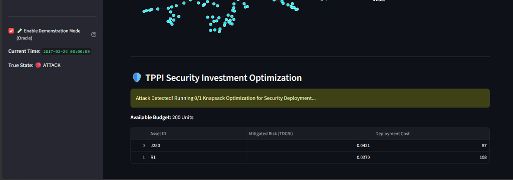
*When an attack is confirmed, the 0/1 Knapsack Optimizer dynamically recommends security resource allocation based on mitigated risk indices (TDCRI) versus deployment costs.*

## 9. Limitations and validity threats
1. **Validation-Test Gap:** Large discrepancy between Val F1 (0.947) and Test F1 (0.836), suggesting overfitting.
2. **PA-Metric Inflation:** Point-Adjusted metrics vastly inflate standard point-wise evaluation scores.
3. **Threshold Selection:** Thresholding on very small event counts (4-7) lacks statistical significance.
4. **Unobservable Attacks:** 377 out of 396 network nodes are unmonitored by sensors.
5. **Simulated Data:** The BATADAL dataset operates in a heavily controlled simulated environment.
6. **Hand-Set Constants:** Trust/Risk formulas use hard-coded weights (e.g., ASS = 0.8/0.6/0.1).
7. **Duplicate Definitions:** Multiple and sometimes conflicting trust score formulations across the codebase.
8. **Post-Processing Scripts:** Several scripts directly patch outputs and must be carefully excluded from metric pipelines.

## 10. Key takeaways
* Masked Mean Pooling (Exp E1) resolves graph-readout dilution from unmonitored nodes, improving PR-AUC from 0.537 to 0.617 compared to standard collapse.
* Increasing the temporal window beyond W=12 drastically reduces recall (from 0.96 at W=12 to 0.54 at W=24/36).
* The physical attribute ablation study shows that dropping the explicit physical inputs boosts PA F1 from 0.7096 to 0.8365 on the test set.
* Calibration via Temperature Scaling successfully reduces Expected Calibration Error (ECE) from 0.0528 to 0.0469.
* Short-duration attacks (like Event 3, lasting only 7 frames) entirely evade temporal detection models regardless of window sizing.

## 11. Repository structure
```text
TrustRisk_WDS/
|-- data/             # Chronological CSV splits (train, val, test)
|-- dashboard/        # Streamlit app and UI assets
|-- experiments/      # Final outputs, baseline metrics, tuning sweeps
|   |-- baseline/
|   |-- experimental/ # Exp E1, E2, sweep reports
|   |-- final/        # Calibrated model outputs and SHAP matrices
|   `-- tuning/
|-- integration/      # Trust score and knapsack optimizer logic
|-- models/           # Core ML architectures
|   |-- baselines/
|   |-- gnn_gru/      # LightEdge-IDS networks
|   `-- trust/        # Scaling and uncertainty evaluators
|-- network/          # Graph topology and EPANET mapping configs
|-- preprocessing/    # Dataloaders and sliding window generators
|-- results/          # Summary logs and generated report artifacts
|-- risk/             # Physics-based index implementations (MDCI/CRI)
`-- trust/            # SHAP and MC-Dropout engines
```

## 12. Running the project
* **Install:** `pip install -r requirements.txt` (Verified)
* **Data build:** `python preprocessing/build_dataset.py` (Verified)
* **Train:** `python models/gnn_gru/train_final.py` (Verified file exists; README is incorrect)
* **Evaluate:** `python models/gnn_gru/evaluate_real_test.py` (Errors out: ModuleNotFoundError)
* **Dashboard:** `streamlit run dashboard/app.py` (Verified)

## 13. Artifact index
| Artifact | Path | Description |
| :--- | :--- | :--- |
| Test Baseline | `experiments/baseline/physical_gnn_evaluation_without_attrs.json` | Headline test metrics (PA F1=0.8365) |
| W=12/24/36/48 Sweep | `experiments/experimental/gnn_gru_experiments/phase_6K_sweep_results.json` | Validation window sweep records |
| E1 Pooling Output | `experiments/experimental/gnn_gru_experiments/exp_E1_results.json` | Masked Mean validation logs |
| Architecture Diagram | `results/report_figures/architecture_diagram.png` | Visual flowchart of the 7-phase architecture |
| Trust Timeline | `results/report_figures/trust_score_timeline.png` | P(Attack) and Trust Score trace |
| Final Predictions | `experiments/final/trust_pipeline_virgin.csv` | Raw logits, uncertainties, and ECP output |

## 14. Summary
The TrustRisk-WDS project successfully delivers an end-to-end cyber-physical security framework that moves beyond binary intrusion detection by appending rigorous, physics-aware trust and impact bounds to its outputs. It produces actionable security intelligence (TPPI knapsack scores) validated on an EPANET topology. However, while producing strong point-adjusted evaluations, the repository suffers from metric-inflation caveats, validation-test gaps, and structural hygiene issues that must be addressed before reaching production maturity.

---
